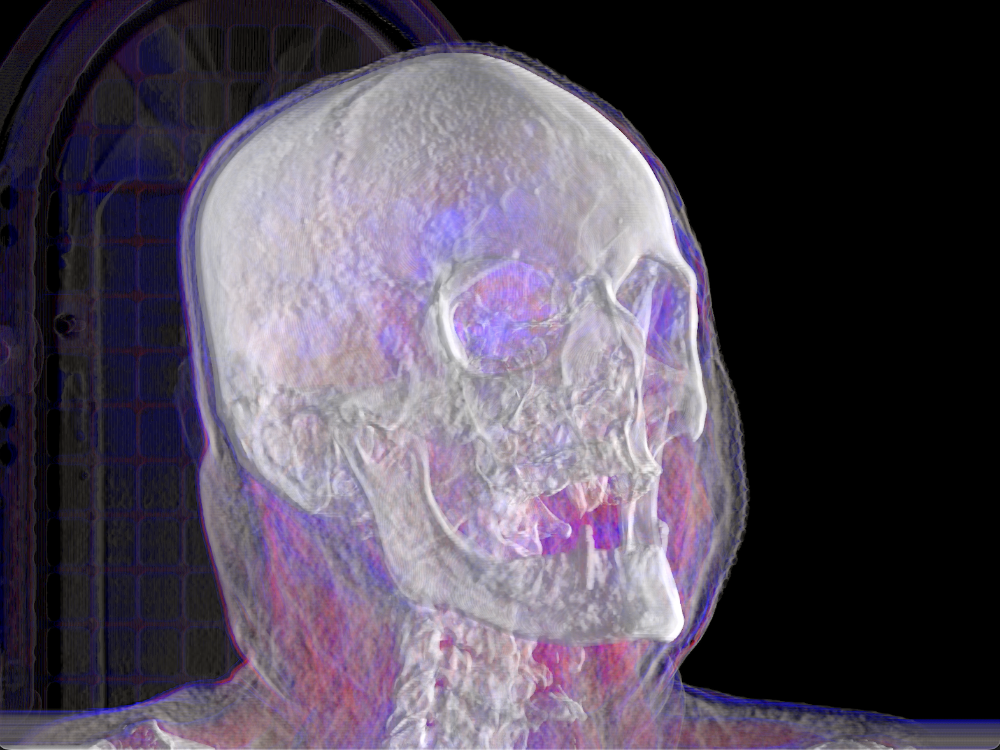

# WGPU Volume Rendering



Real time volumetric rendering of a dicom image with web gpu based on [webgpu-and-volume-rendering](https://github.com/davazp/webgpu-and-volume-rendering)

## Usage

```
cargo run
```

use arrow keys to move and slice the volume
